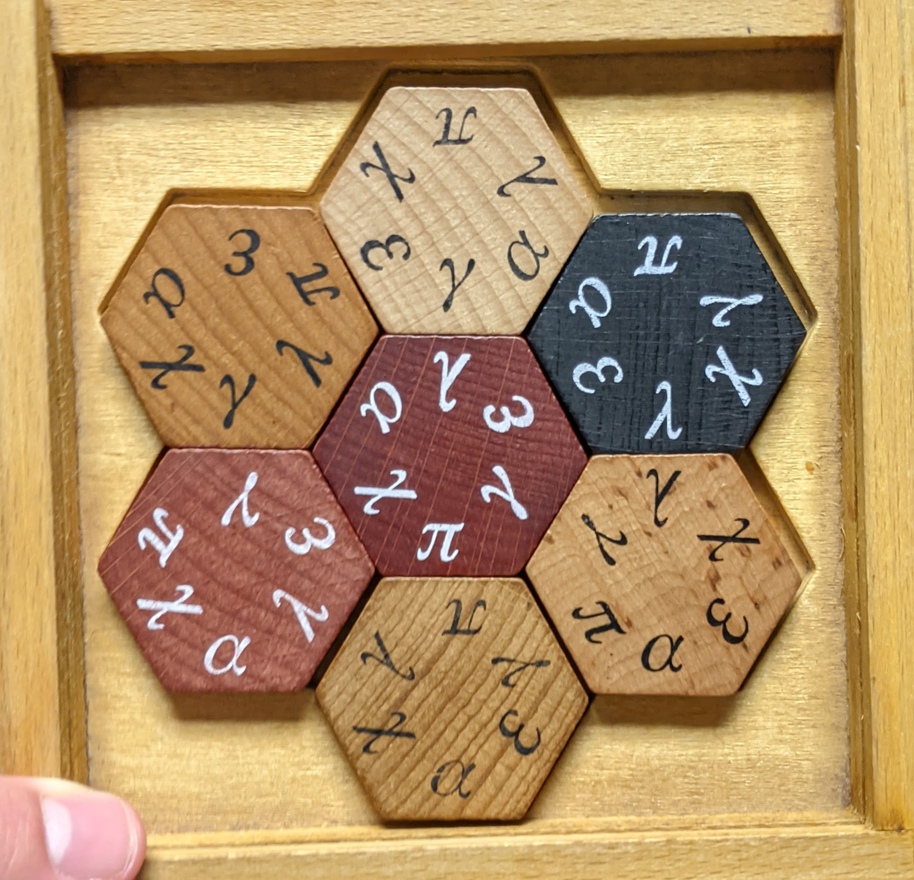

# Hexagon Standoff Solver

Solver for the Hexagon Standoff puzzle from "Professor Puzzle" - implemented in Kotlin and built with [Bazel](https://bazel.build/).

## Build / run

`bazel run //hexagon`

## Puzzle



Hexagon Standoff is a tile placement game produced by [Professor Puzzle](https://professorpuzzle.com/). The game is played with seven hexagonal tiles that have symbols printed on each edge. All tiles share the same six symbols, but the relative position of the symbols is unique for each tile. The player must place and rotate the tiles so that all edges between two tiles share a matching symbol.

## Solution

There are `7! = 5040` ways to choose which tile to place in each board position and 6 ways to independently rotate each tile, for a total of `7! * 6^7 = 1,410,877,440` possible board states. The solver iterates over each possible state and checks each state against all pairs of board locations which should have a matching symbol. For example, the first solution found is:

```
Solution found with slottings [4, 5, 3, 1, 2, 0, 6] and offsets [4, 5, 5, 4, 4, 2, 1]
```

Where the "slottings" array represents the board placement of each tile (e.g. board "slot" 0 should contain piece 4) and the "offsets" array represents the subsequent rotation (the piece in board slot 0 should be rotated counter-clockwise by 4 positions).

There are six total solutions - note that these correspond to rotation symmetries of the same solution around the center of the board:

```
Solution found with slottings [4, 5, 3, 1, 2, 0, 6] and offsets [4, 5, 5, 4, 4, 2, 1]
Solution found with slottings [1, 4, 5, 6, 2, 3, 0] and offsets [3, 3, 4, 0, 3, 4, 1]
Solution found with slottings [5, 3, 0, 4, 2, 6, 1] and offsets [0, 0, 3, 5, 5, 2, 5]
Solution found with slottings [0, 6, 1, 3, 2, 4, 5] and offsets [5, 4, 1, 2, 1, 1, 2]
Solution found with slottings [6, 1, 4, 0, 2, 5, 3] and offsets [5, 2, 2, 0, 2, 3, 3]
Solution found with slottings [3, 0, 6, 5, 2, 1, 4] and offsets [1, 4, 3, 1, 0, 0, 0]
```
